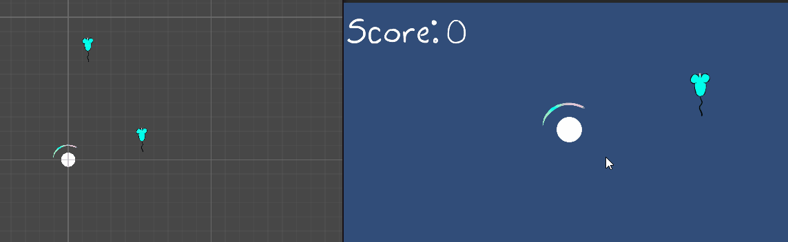

# M3BORhythmGame

# Mechanic 1 barrier rotation

ik heb er voor gezorgd dat je met A, D, < en > heen en weer kan bewegen.  
Ook kan je met spatie een volle 180 draaien.  
[Script](M3BO%20rhythm%20game/Assets/Scripts/BarrierRotation.cs)

# Mechanic 2 noten movement + collision

ik heb voor movement gezorgd voor de noten waarbij de note zichzelf destroyed bij het eindpunt  
[Script](M3BO%20rhythm%20game/Assets/Scripts/NoteMovement1.cs)  
ook heb ik de barrier een script gegeven waarbij op collision de note destroyed word  
[Script](M3BO%20rhythm%20game/Assets/Scripts/BarrierDestroy.cs)

# Mechanic 3 noten spawner  

Marcos heeft gezorgd dat er notespawner is om een voorlopige gameloop te maken  
[Script](M3BO%20rhythm%20game/Assets/Scripts/NoteSpawner.cs)